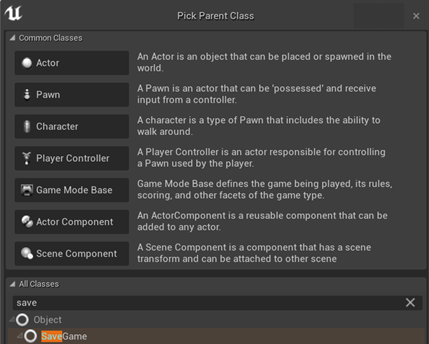
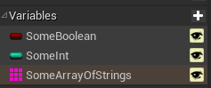
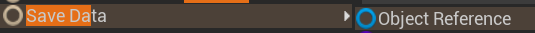
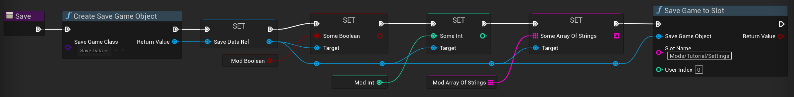
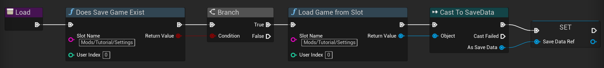
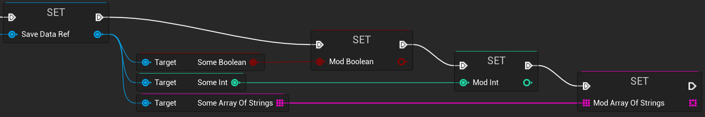
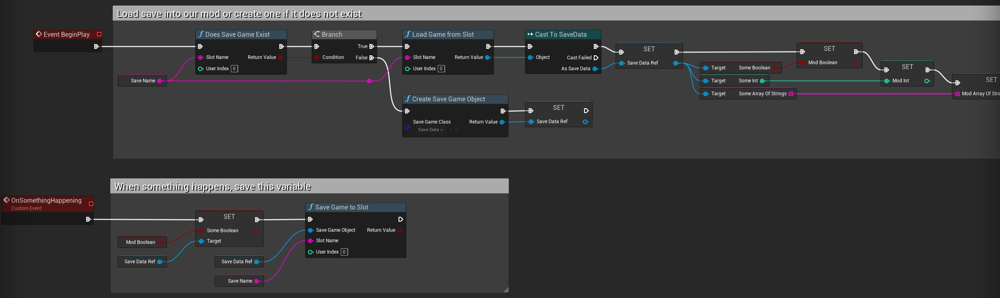
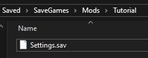

# Custom Mod Game Saves

When you want to save state across levels or game sessions, you can create your own game saves in your blueprint mod.

> [!TIP]
> Saves are stored in the `Saved/SaveGames` folder in the game's directory, which is usually located in the `AppData` folder. This directory can be changed by the game, so the saves will be placed in the same area as where the game's saves are located.

## Creating a save game object

First, create a new blueprint actor that inherits from the `SaveGame` class.

Next, add the variables you want to save to the blueprint. Set the variables to public to be able to access them from your mod blueprints.

Back in our mod, make a variable that is an object reference to the blueprint you just created. In this example, my blueprint is named `SaveData`.

## Saving data to the save game object

First you need to create the save game object reference and set it to the object reference variable. 

> [!TIP]
> To avoid creating the reference multiple times, you can create the reference on the `BeginPlay` event.

Then you can set the variables in the save game object to the variables you want to save.

Finally, call the `SaveGameToSlot` function to save the data to the slot. The slot name can be whatever you like, however to keep the game's save folder orderly, I suggest a name like `Mods/[your mod name]/[your save name]`. 

> [!TIP]
> Make a string variable called `SaveName` and set it to the slot name. This way you can easily change the slot name in one place.

## Loading data from the save game object

First you need to check if the save game exists. If it does, you can load the game from the slot. Then we need to cast the returned value to our save game object.

You can set the variables in the save game object to the variables you want to load.

## Putting it together

Here is a simplified example of saving and loading data. It is recommended to use functions to keep your code clean and organized. You can add functions within your save game blueprint to handle this, or just do it within your mod blueprint.

Here is the resulting save file in the game's folder.

