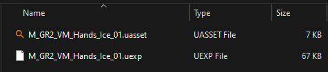
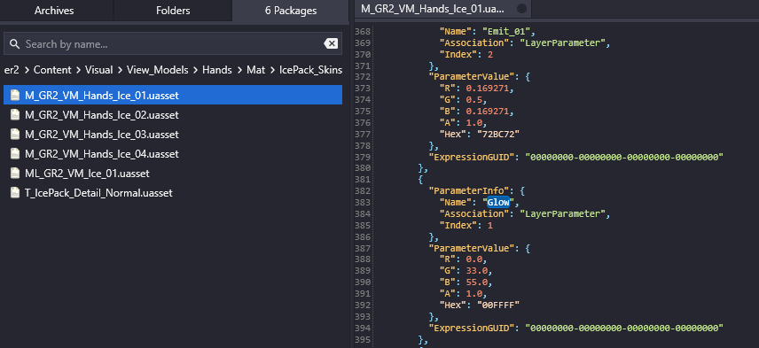
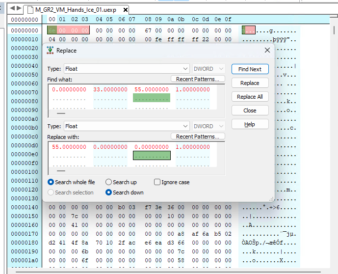
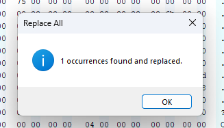
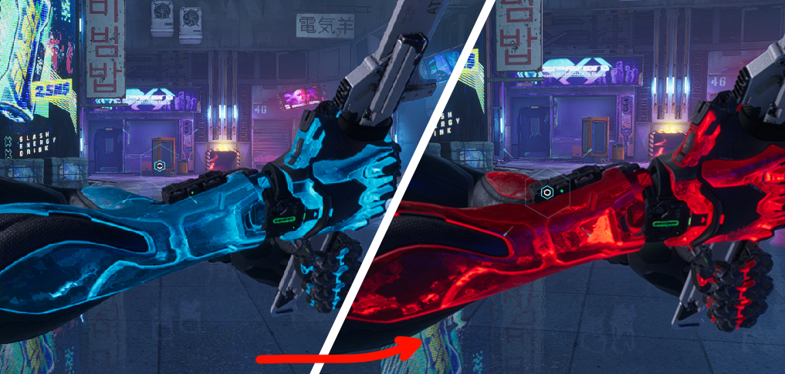

# Hex Editing
Hex editing is quite rare nowadays, as we can use UAssetGUI for it but sometimes that tool fails so it's a good thing to know how to do it manually.

## Getting Default Values
Start by finding the asset you're interested in modifying and exporting it using FModel or UModel.

For this example, I will be changing the gloves glow color in Ghostrunner 2, from blue to red.

Using FModel, I can get the exact RGB values of the glow, which are `0.0, 33.0, 55.0, 1.0`. 

## Replacing Values using Hex (method 1)
Exported files come in pairs of `.uasset` and `.uexp`. 
Values are stored in `.uexp` so that's the file we need to edit.

Open the `.uexp` file with a hex editor (I'm using Hex Editor Neo). 
Click Ctrl+H to open the Replace window (depending on the software you use, you may have different keybinding). 
Ensure the type is `Float` and enter the original values and the desired values.  
**Note:** If you don't have this replace feature, try [method 2](#replacing-values-using-hex-method-2).
  

Then click "Replace All", and if done properly a success window will be shown.

## Packing
Once you're done with replacing hex values, pack your modified 
`.uexp` file into its pak file using UnrealPak.

### Results

   

## Replacing Values using Hex (method 2)
In case you don't have the replace feature in your hex editor, you can find the values by providing an array of hex values.

So for this example, the values are `0.0, 33.0, 55.0, 1.0` which need to be converted to little-endian hexadecimal representation.

Input these values into the search panel to find the values in the file.

In this simple example, the combination is unique so only one result is found.

Now replace these hex values with the desired hex, for this example, that's  
`55, 0, 0, 1` which is `00 00 5c 42 00 00 00 00 00 00 00 00 00 00 80 3F`.
  _(the 55 is the strength of the glow in this particular case, usually it's between 0.0 and 1.0)_

Save the file, and pack the modified `.uexp` using UnrealPak.

## FAQ
Q: What if the values are not unique? 
A: Try to find a series of values around the actual variable. 
If the target value is followed/surrounded by another one, check that it appears in the corresponding order.